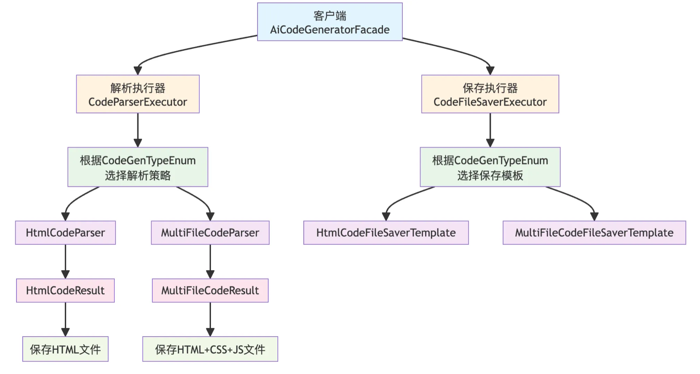

# AI代码生成平台

## 项目介绍

这是一套以 **AI 开发实战 + 后端架构设计** 为核心的项目，基于 Spring Boot 3 + LangChain4j + Vue 3 的 **AI 代码生成平台**

### 预期实现的 4 大核心能力

1）智能代码生成：用户输入需求描述，AI 自动分析并选择合适的生成策略，通过工具调用生成代码文件，采用流式输出让用户实时看到 AI 的执行过程。

2）可视化编辑：生成的应用将实时展示，可以进入编辑模式，自由选择网页元素并且和 AI 对话来快速修改页面，直到满意为止。

3）一键部署分享：可以将生成的应用一键部署到云端并自动截取封面图，获得可访问的地址进行分享，同时支持完整项目源码下载。

4）企业级管理：提供用户管理、应用管理、系统监控、业务指标监控等后台功能，管理员可以设置精选应用、监控 AI 调用情况和系统性能。

## 第一次提交 init - 基础代码和依赖整理

## 第二次提交 用户模块

    1、MybatisFlex生成数据模型
    2、用户注册接口、用户登录接口
    3、用户管理以及用户权限控制（AOP + 自定义注解）

## 第三次提交 AI生成应用模块

    1、实现 AI 应用生成（原生模式）
    2、门面模式
    3、SSE 流式输出

## 第三次提交 AI生成应用模块 2
代码优化 - 使用设计模式抽象代码
    

    1、首先使用执行器模式，通过选择不同执行器来实现不同功能，再选择不同参数决定选择策略
    2、然后是策略模式，通过传过来的不同参数，决定使用不同方法策略完成任务
    3、模板方法模式是因为相似功能，但是方法参数不同造成的大量重复代码，因此通过模板方法模式，重用共同方法，重写不同方法

## 第四次提交 应用模块 - 建立完整的应用生命周期管理体系

    1、MybatisFlex生成数据库表对应的基础数据实体
    2、app相关的基础功能，包括不同角色的应用的增删改查等

## 第五次提交 应用模块2 - 建立完整的应用生命周期管理体系
应用生成 - 客户端、数据库和app应用的链接

    1、SSE 流式接口开发及优化 - 传入appId、message调用接口
    2、应用部署 - 接口生成的文件通过nginx自动部署并显示出来

## 第六次提交 对话历史模块1

    1、chat_history表及相关实体的生成
    2、通过游标查询查询对话历史

## 第七次提交 对话历史模块2

    1、通过给容器id分配AI Service实例来隔离会话，实现对话记忆
    2、Caffeine实现缓存AI Service实例

## 第八次提交 工程项目生成1

    1、配置推理流式模型，开发写文件工具
    2、支持 Vue 项目生成
    3、工具调用流式输出、统一消息格式、TokenStream流处理